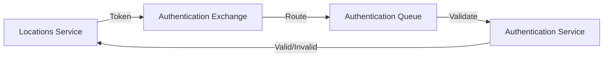

# 🛠️ Microservices: Authentication & Locations API

A robust microservices architecture implementing authentication and location-based services with RabbitMQ communication.

## 📋 Overview

This project consists of two microservices:

- **Authentication Service**: Handles JWT token generation and validation
- **Locations Service**: Processes location-based requests with authentication

## 🚀 Technology Stack

- **Go (Golang)** - Core programming language
- **RabbitMQ** - Message broker for inter-service communication
- **JWT** - Token-based authentication
- **PostgreSQL** - Spatial database
- **PostGIS** - Spatial database extension
- **OpenStreetMap** - Geocoding data source

## 🏗️ Architecture

### Authentication Service
```
/authentication-service/
├── internal/
│   └── constants/        # Configuration & constants
├── main.go              # HTTP server & RabbitMQ consumer
├── handlers.go          # Token operations
├── rabbitmq.go         # Message broker setup
└── routes.go           # HTTP endpoints
```

### Locations Service
```
/locations-service/
├── internal/
│   └── constants/        # Configuration & constants
├── main.go              # HTTP server & RabbitMQ publisher
├── middleware.go        # Authentication middleware
├── handlers.go          # Location endpoints
├── rabbitmq.go         # Message broker client
└── routes.go           # HTTP endpoints
```

## ✨ Features

### Authentication Service
- JWT token generation (`POST /generate-token`)
- Token verification via RabbitMQ
- Secure communication channel

### Locations Service
- Authentication middleware integration
- RabbitMQ token validation
- Location data processing (`GET /locations`)
- Reverse geocoding capabilities

## 🚀 Setup Instructions

### 1. RabbitMQ Setup
```bash
docker run -d --name rabbitmq \
    -p 5672:5672 \
    -p 15672:15672 \
    rabbitmq:management
```

### 2. PostgreSQL & Geocoding Setup

#### Prerequisites
- PostgreSQL with PostGIS
- OpenStreetMap data (bulgaria-latest.osm.pbf)
- osm2pgsql
- Python (for data processing)
- default.style configuration file, present in project or at https://github.com/osm2pgsql-dev/osm2pgsql/blob/master/default.style

#### Database Configuration
```bash
# Create database
"C:\Program Files\PostgreSQL\17\bin\createdb.exe" -U postgres database_name

# Enable extensions
"C:\Program Files\PostgreSQL\17\bin\psql.exe" -U postgres -d database_name -c "CREATE EXTENSION postgis;"
"C:\Program Files\PostgreSQL\17\bin\psql.exe" -U postgres -d database_name -c "CREATE EXTENSION hstore;"

# Import OSM data
osm2pgsql -U postgres -H localhost -d database_name -W --hstore \
    -S "path_to_default.style" "path_to_osm.pbf"
```

### 3. Start Services

```bash
# Authentication Service
cd authentication-service
go run main.go

# Locations Service
cd locations-service
go run main.go
```

## 🔄 Message Flow


