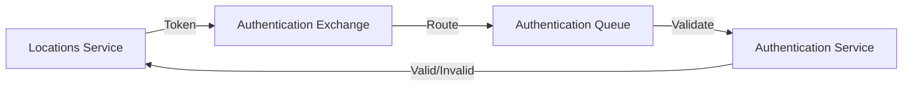

# 🛠️ Microservices: Authentication & Locations API

A robust microservices architecture implementing authentication and location-based services with RabbitMQ communication.

## 📋 Overview

This project consists of two microservices:

- **Authentication Service**: Handles JWT token generation and validation
- **Locations Service**: Processes location-based requests with authentication

## 🚀 Technology Stack

- **Go (Golang)** - Core programming language
- **RabbitMQ** - Message broker for inter-service communication
- **JWT** - Token-based authentication
- **PostgreSQL** - Spatial database
- **PostGIS** - Spatial database extension
- **OpenStreetMap** - Geocoding data source

## 🏗️ Architecture

### Authentication Service
```
/authentication-service/
├── internal/
│   └── constants/        # Configuration & constants
├── main.go              # HTTP server & RabbitMQ consumer
├── handlers.go          # Token operations
├── rabbitmq.go         # Message broker setup
└── routes.go           # HTTP endpoints
```

### Locations Service
```
/locations-service/
├── internal/
│   └── constants/        # Configuration & constants
├── main.go              # HTTP server & RabbitMQ publisher
├── middleware.go        # Authentication middleware
├── handlers.go          # Location endpoints
├── rabbitmq.go         # Message broker client
└── routes.go           # HTTP endpoints
```

## ✨ Features

### Authentication Service
- JWT token generation (`POST /generate-token`)
- Token verification via RabbitMQ
- Secure communication channel

### Locations Service
- Authentication middleware integration
- RabbitMQ token validation
- Location data processing (`GET /locations`)
- Reverse geocoding capabilities

## 🚀 Setup Instructions

### Prerequisites
1. Add PostgreSQL bin directory to PATH:
   ```
   C:\Program Files\PostgreSQL\version\bin
   ```
2. Download GDAL binaries from https://gisinternals.com/release.php and extract them
3. PostgreSQL with PostGIS
4. OpenStreetMap data (bulgaria-latest.osm.pbf)
5. osm2pgsql
6. Python (for data processing)
7. default.style configuration file (from project or https://github.com/osm2pgsql-dev/osm2pgsql/blob/master/default.style)

### 1. RabbitMQ Setup
```bash
docker run -d --name rabbitmq \
    -p 5672:5672 \
    -p 15672:15672 \
    rabbitmq:management
```

### 2. PostgreSQL & Geocoding Setup

#### Database Configuration
```bash
# Access PostgreSQL
psql -U postgres

# Create and configure database
CREATE DATABASE tourism_pois;
\c tourism_pois
CREATE EXTENSION postgis;
CREATE EXTENSION postgis_topology;

# Create tourism POI table
CREATE TABLE tourism_poi (
    id SERIAL PRIMARY KEY,                     -- Auto-incremented primary key
    osm_id TEXT UNIQUE,                        -- Store the @id from GeoJSON
    name TEXT,                                 -- Name of the point (e.g., Kavatsi, Strinava)
    tourism TEXT,                              -- Type of tourism (e.g., camp_site)
    "natural" TEXT,                            -- Natural feature (e.g., peak)
    ele INTEGER,                               -- Elevation, if available
    wikidata TEXT,                             -- Optional, if available
    caravans TEXT,                             -- Whether caravans are available
    drinking_water TEXT,                       -- Availability of drinking water
    power_supply TEXT,                         -- Power supply availability
    shower TEXT,                               -- Shower availability
    tents TEXT,                                -- Tents availability
    toilets TEXT,                              -- Toilet availability
    geom GEOMETRY(Point, 4326)                 -- Latitude & Longitude
);

# Exit PostgreSQL
\q
```

#### Import GeoJSON Data for Places of Interes (POIs)
1. Run SDKShell.bat from the GDAL binaries folder
2. Run the following command:
```bash
ogr2ogr -f "PostgreSQL" PG:"host=localhost dbname=tourism_pois user=postgres password=admin123" "path_to_your_exported_geojson_file.geojson" -nln tourism_pois
```

#### OSM Data Import for Location Information
```bash
# Create database
"C:\Program Files\PostgreSQL\17\bin\createdb.exe" -U postgres database_name

# Enable extensions
"C:\Program Files\PostgreSQL\17\bin\psql.exe" -U postgres -d database_name -c "CREATE EXTENSION postgis;"
"C:\Program Files\PostgreSQL\17\bin\psql.exe" -U postgres -d database_name -c "CREATE EXTENSION hstore;"

# Import OSM data
osm2pgsql -U postgres -H localhost -d database_name -W --hstore \
    -S "path_to_default.style" "path_to_osm.pbf"
```

### 3. Start Services

```bash
# Authentication Service
cd authentication-service
go run main.go

# Locations Service
cd locations-service
go run main.go
```

## 🔄 Message Flow


